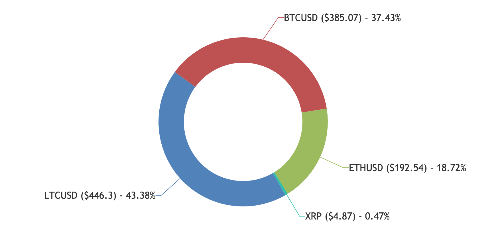

# MoonToday

MoonToday is a tool for managing your cryptocurrency asset portfolio.

## Quickstart

Visit the [live instance](http://moon-today.herokuapp.com) or follow the instructions below to spin up an instance.

1) `npm install`

2) `npm start`

3) Navigate to `localhost:8080`

## Features

### Portfolio summary

### Market insights

