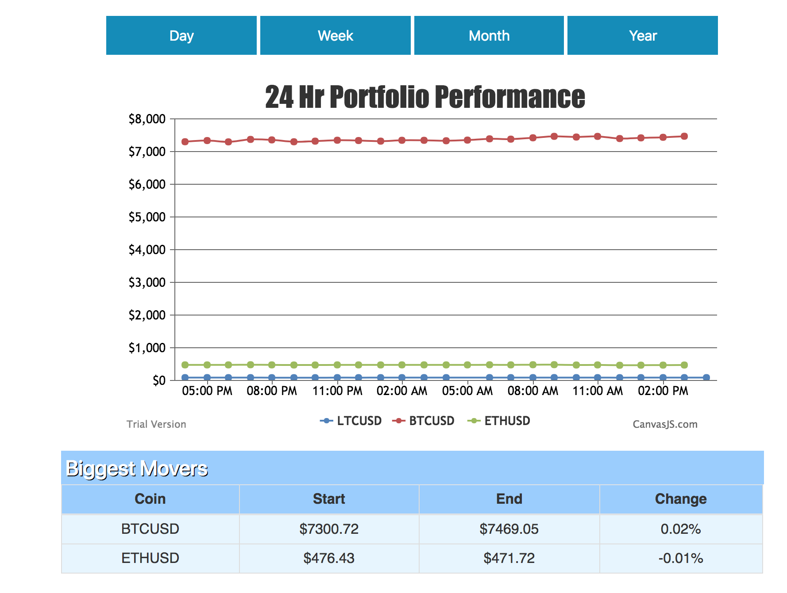

# MoonToday

MoonToday is a tool for managing your cryptocurrency asset portfolio.

## Quickstart

Visit the [live instance](http://moontoday) or follow the instructions below to spin up an instance.

1) Install dependencies
`npm install`

2) Initialize database
`node init.js`

3) Start the server
`node server.js`

4) Navigate to 
`localhost:3000`

## Features

### Portfolio summary

### Market insights

